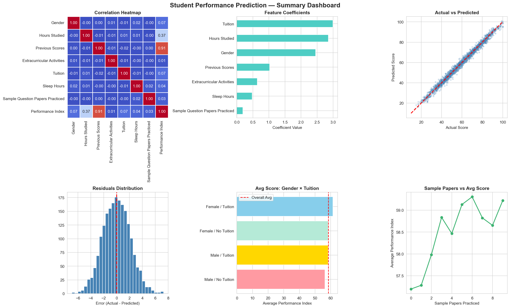

# 🎓 Student Performance Prediction using Machine Learning

## 📌 Project Objective

The objective of this project is to build a **Machine Learning model** that predicts a student's **Performance Index** based on academic history and study habits. The project includes Exploratory Data Analysis (EDA), data preprocessing, Linear Regression model building, model evaluation, and a live prediction function to estimate student performance.

---

## 📂 Dataset Used

- **Dataset:** <a href="https://github.com/ruhi1326/Student_Performance_Prediction/blob/main/student_performance_dataset.csv">Student Performance Dataset</a>
- **Records:** 10,000 Students
- **Features:** 7 Independent Variables
- **Target Variable:** Performance Index

### Features Used

- Gender
- Hours Studied
- Previous Scores
- Extracurricular Activities
- Tuition
- Sleep Hours
- Sample Question Papers Practiced

---

## 🛠 Tools & Libraries Used

- Python
- Jupyter Notebook
- Pandas
- NumPy
- Matplotlib
- Seaborn
- Scikit-learn

---

## 📊 Project Workflow

### 1️⃣ Exploratory Data Analysis (EDA)

Performed detailed data exploration to understand relationships between different student attributes and academic performance.

Analysis included:

- Data Overview
- Descriptive Statistics
- Missing Value Check
- Duplicate Check
- Distribution Analysis
- Correlation Analysis
- Feature Relationship Analysis

---

### 2️⃣ Data Preprocessing

Prepared the dataset for Machine Learning by:

- Encoding categorical variables
- Defining Features (X) and Target (y)
- Splitting data into Training (80%) and Testing (20%) datasets

---

### 3️⃣ Model Building

Built a **Linear Regression Model** to learn the relationship between study habits and student performance.

The model was trained using:

- Training Dataset
- Linear Regression Algorithm
- Feature Coefficients Analysis

---

### 4️⃣ Model Evaluation

Model performance was evaluated using:

- RMSE (Root Mean Squared Error)
- R² Score
- Actual vs Predicted Scatter Plot
- Residual Distribution

---

### 5️⃣ Live Prediction

Developed a `predict_score()` function that allows users to enter student information and instantly predict the expected Performance Index.

---

# 📈 Summary Dashboard Preview

<p align="center">
  
</p>

---

# 📊 Dashboard Insights

### 🔹 Correlation Heatmap

- Previous Scores showed the strongest positive correlation with Performance Index.
- Hours Studied was the second most influential feature.
- Sleep Hours and Sample Papers had relatively lower correlations.

---

### 🔹 Feature Importance

The Linear Regression coefficients indicate:

- Tuition had the highest contribution toward predicted scores.
- Hours Studied significantly improves performance.
- Previous Scores remain one of the strongest predictors.
- Extracurricular Activities and Sample Papers have comparatively smaller influence.

---

### 🔹 Actual vs Predicted Scores

- Predicted scores closely align with actual scores.
- Most observations lie near the ideal prediction line, indicating strong model accuracy.

---

### 🔹 Residual Distribution

- Errors are centered around zero.
- Residuals follow an approximately normal distribution.
- Indicates minimal prediction bias.

---

### 🔹 Average Performance Analysis

Students attending tuition generally achieved higher average performance regardless of gender.

---

### 🔹 Sample Papers vs Performance

Practicing more sample papers shows a gradual improvement in average performance, although the impact is less significant than previous scores or study hours.

---

# 📌 Key Findings

- Previous Scores are the strongest predictor of student performance.
- Hours Studied has a significant positive impact on predicted scores.
- Tuition attendance noticeably improves academic performance.
- Female students achieved slightly higher average scores than male students.
- Sleep Hours positively contribute to performance but with moderate influence.
- Sample Question Papers Practiced have relatively limited impact compared to study hours and previous scores.

---

# 📈 Model Performance

| Metric | Value |
|---------|--------|
| RMSE | **2.11** |
| R² Score | **0.9875** |
| Predictions within ±5 Marks | **98.2%** |

---

# 💡 Recommendations

- Encourage consistent daily study habits rather than last-minute preparation.
- Support students with lower previous scores through early intervention programs.
- Promote structured tuition or academic mentoring where needed.
- Encourage healthy sleep habits to maintain consistent academic performance.
- Focus on improving conceptual understanding alongside solving practice papers.

---

# 📁 Project Structure

```
Student-Performance-Prediction/
│
├── EDA_&_Prediction_Func.ipynb
├── student_performance_dataset.csv
├── student_predictions.csv
├── Summary_dashboard_Img.png
├── README.md
```

---

# 📚 Learning Outcomes

Through this project, I gained hands-on experience in:

- Exploratory Data Analysis (EDA)
- Feature Engineering
- Data Preprocessing
- Linear Regression
- Model Evaluation
- Data Visualization
- Predictive Analytics
- Python-based Machine Learning Workflow

---

# 👩‍💻 Author

**Hinal Patel**

Aspiring Data Analyst | Python | SQL | Power BI | Excel | Machine Learning

---
